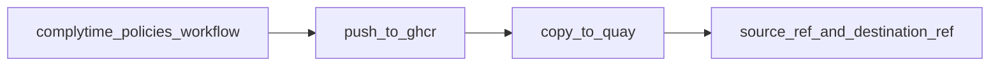

# complytime-policies

Centralized repository for Gemara policies used by [ComplyTime](https://github.com/complytime) tooling. Policies defined here are published as OCI artifacts to a public **Quay.io** namespace and consumed (for example via `complyctl get`).

## Current publish design

Workflow: [`.github/workflows/publish-policy-oci.yml`](.github/workflows/publish-policy-oci.yml)

- **Thin caller:** a single `uses:` of the composite
  [`sonupreetam/gemara-publish-oci@967268e281b90e12b88224231583a04bb57a5c3f`](https://github.com/sonupreetam/gemara-publish-oci) (see [PR #4](https://github.com/sonupreetam/gemara-publish-oci/pull/4) / `feat/demo-push-only`); bump the SHA in the workflow when the action changes.
- **Pin table (FR-006 / T004):** the **callee** pin is the composite SHA above (also in [`.github/workflows/publish-policy-oci.yml`](.github/workflows/publish-policy-oci.yml)). This **Option 3** layout does **not** add a second line item for [complytime/org-infra **`resuable_publish_quay.yml`**](https://github.com/complytime/org-infra/blob/main/.github/workflows/resuable_publish_quay.yml) because promote is **inside** the action. On **convergence** to a caller **`workflow_call`** to that reusable, add its **commit SHA** here and in the workflow.
- **Defaults (dispatch):** `trust_mode: resign`, `verify_quay: true` (destination `cosign verify` after promote when promote runs); `sign_source` / `verify_source` stay off unless you change the workflow. Forks can set `allow_unprotected_ref: true` to run without a protected branch.
- **Overlapping runs & dest tags (T007 / FR-002, spec Edge Cases):** workflow **`concurrency`** uses group `publish-policy-oci` with `cancel-in-progress: false` (see workflow file). Use a **new** `release_tag` per intentional release. **`fail_if_dest_exists`** and related promote flags are **not** set on *this* caller repo’s `with:` for **Option 3** (they apply when calling org-infra’s **`resuable_publish_quay`** `workflow_call`); the composite’s internal ORAS path defines overwrite/tag behavior. See [contracts/publish-pipeline.md](specs/001-policy-oci-publish/contracts/publish-pipeline.md).



## Required secrets

- `QUAY_ROBOT_USERNAME`
- `QUAY_ROBOT_TOKEN`
- `GITHUB_TOKEN` is used automatically for GHCR

Forks must define their own repository secrets.

## Who can run the publish workflow (T008, FR-002)

The job runs when **`github.ref_protected` is true** (e.g. dispatch from a **protected** default or release branch) **or** when you set the dispatch input **`allow_unprotected_ref: true`**. The publish job is **skipped** if the ref is **not** protected **and** `allow_unprotected_ref` is false (the default), so forks and unprotected branches need **`allow_unprotected_ref: true`**. See [`.github/workflows/publish-policy-oci.yml`](.github/workflows/publish-policy-oci.yml) (`if:` on the `publish` job).

- **Org production:** use branch protection and maintainers with permission to run **Actions → Publish policy OCI**; align **`dest_image`** and secrets with your namespace policy.
- **Forks / demos:** set **`allow_unprotected_ref: true`**, add **`QUAY_ROBOT_*`**, and do not expect upstream secrets to be inherited.
- **Optional GitHub Environment** (e.g. `publish-oci-prod`): not set in the checked-in workflow. If your org requires an [environment](https://docs.github.com/en/actions/deployment/targeting-different-environments/using-environments-for-deployment) (approvals, wait timers), add `environment: <name>` to the job in agreement with maintainers and document the name here when you do.

## Run a release

Use **Actions -> Publish policy OCI -> Run workflow** and set:

- `release_tag` (required)
- optional `bundle_file` (default: `bundles/cis-fedora-l1-workstation.yaml`)
- optional `dest_image` (default: `test_complytime/complytime-policies`)
- optional `trust_mode`, `verify_quay`
- optional `allow_unprotected_ref` (`true` for unprotected fork branches)

Success criteria:

- workflow job passes
- logs contain `source_ref`, `destination_ref`, and (when `verify_quay` is true) `verified_destination`

## E2D / SC-003 (T019)

*Fill this in after a successful `workflow_dispatch` to prove **SC-003** (end-to-end staging → promote → verify) for maintainers. Replace the placeholder; link to a specific Actions run and note `release_tag` and any digest you rely on for consumers.*

- **E2D evidence (placeholder):** *(add: GitHub Actions run URL, `release_tag`, optional `destination` digest, date)*

## Policy content

- Catalogs: `governance/catalogs/`
- Policies: `governance/policies/`
- Bundle roots: `bundles/*.yaml`

## Usage

```bash
complyctl get
```

## License

Apache-2.0. See [LICENSE](LICENSE).
