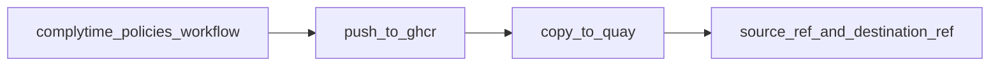

# complytime-policies

Centralized repository for Gemara policies used by [ComplyTime](https://github.com/complytime) tooling. Policies defined here are published as OCI artifacts to a public **Quay.io** namespace and consumed (for example via `complyctl get`).

## Current publish design

Workflow: [`.github/workflows/publish-policy-oci.yml`](.github/workflows/publish-policy-oci.yml)

- Thin caller model: this repo calls the pinned action
  `sonupreetam/gemara-publish-oci@3e82d5dfa822ce486ce9b129665e8b6db3e7b2b9`
- Current mode is push-only:
  - `sign_source: false`
  - `verify_source: false`
  - `trust_mode: copy-only` (default input)
  - `sign_destination: false`
  - `verify_destination: false`



## Required secrets

- `QUAY_ROBOT_USERNAME`
- `QUAY_ROBOT_TOKEN`
- `GITHUB_TOKEN` is used automatically for GHCR

Forks must define their own repository secrets.

## Run a release

Use **Actions -> Publish policy OCI -> Run workflow** and set:

- `release_tag` (required)
- optional `bundle_file` (default: `bundles/cis-fedora-l1-workstation.yaml`)
- optional `dest_image` (default: `test_complytime/complytime-policies`)
- optional `allow_unprotected_ref` (`true` for unprotected fork branches)

Success criteria:

- workflow job passes
- logs contain `source_ref` and `destination_ref`

## Policy content

- Catalogs: `governance/catalogs/`
- Policies: `governance/policies/`
- Bundle roots: `bundles/*.yaml`

## Usage

```bash
complyctl get
```

## License

Apache-2.0. See [LICENSE](LICENSE).
