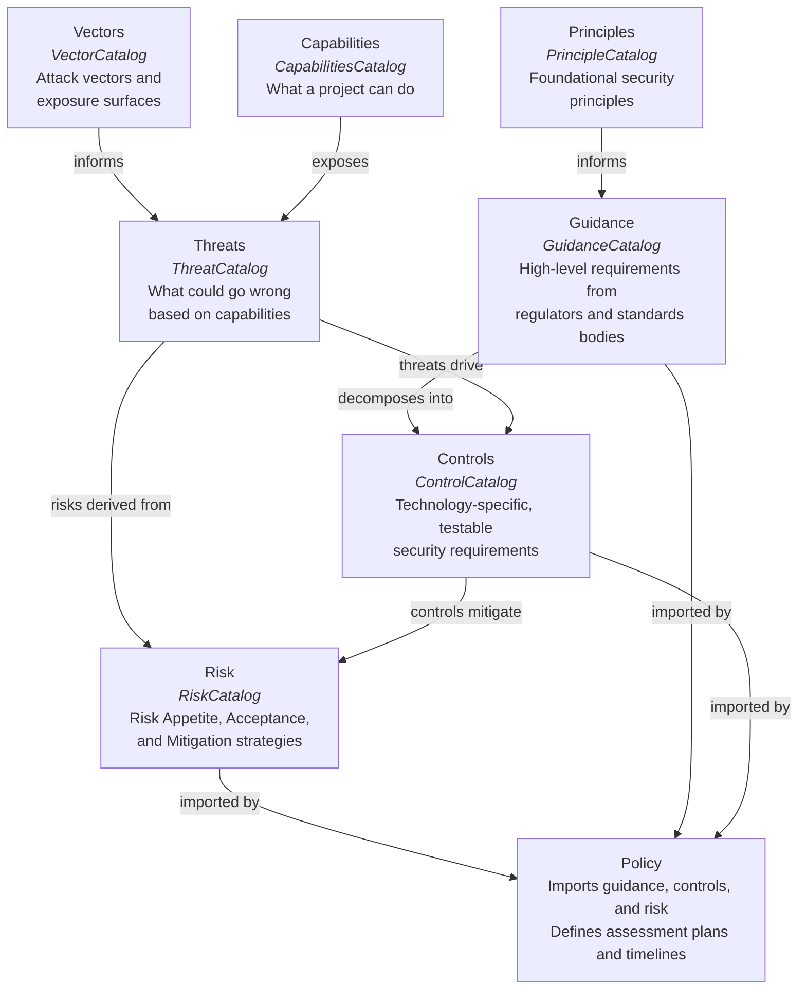

# Lexicon of Terms

A glossary of terms used across the ComplyTime ecosystem. Terms are grouped by topic. If you're brand new, start with [Gemara Project](#gemara-project) and [ComplyTime](#complytime) to orient yourself, then explore other sections as needed.

---

## Table of Contents

- [ComplyTime](#complytime)
  - [Why This Approach?](#why-this-approach)
- [Gemara Project](#gemara-project)
  - [The Model](#the-model)
  - [Guidance vs. Controls](#whats-the-difference-between-a-guidance-catalog-and-a-control-catalog)
  - [Catalogs](#catalogs)
  - [Mapping Document](#mapping-document)
  - [Policy](#gemara-policy)
  - [Confidence Level](#confidence-level)
- [OCI (Open Container Image)](#oci-open-container-image)
- [Related Projects](#related-projects)
- [Tools](#tools)
  - [OpenTelemetry Collector](#opentelemetry-collector)

---

## ComplyTime

### complyctl

A compliance runtime that pulls [Gemara](#the-model) policies from an [OCI (Open Container Initiative)](#oci-open-container-image) registry and executes scans using [providers](complytime-providers-overview.md). Currently, the [Ampel](#ampel) provider verifies branch protection settings on GitHub and GitLab repositories.

See the [complyctl overview](complyctl-overview.md) for persona-specific walkthroughs and CLI usage.

### Why This Approach?

Manual compliance activities rely on static documents -- spreadsheets of controls, PDFs of policies, screenshots as evidence.

This creates three problems that all center around cross-functional communication:

1. **Drift**: Policies and implementations diverge silently; it is difficult to know this until audit preparation
2. **Toil**: every assessment cycle requires manual evidence collection, reformatting, and cross-referencing
3. **Ambiguity**: the same regulatory control statement gets interpreted differently by every team that implements it

There are tools that solve individual pieces of the compliance problem. ComplyTime connects them.

| **Category** | **What they do** | **Gap ComplyTime fills** |
|:--|:--|:--|
| GRC SaaS platforms | Policy management, evidence workflows, audit coordination | Not code-native, no CI/CD integration, evidence is uploaded |
| Standalone scanners | Evaluate technical configs against rule files | No framework mapping, no policy versioning, no unified output format or reports |
| Policy engines | Enforce allow/deny decisions at runtime | Decision-making only. There is no evidence generation, no assessment lifecycle, and no GRC layer |
| Evidence ingestion services | Accept and normalize scanner output | No assessment plan or client-side reporting to show what was collected and prove what was missed |

> Note: The contract is the Gemara schema, not the tool. `complyctl` is the fastest way to produce conformant artifacts, but any tooling that produces valid Gemara artifacts works with the ecosystem.

**When to use what:**
- If you only need scanning, use a scanner directly.
- If you only need policy decisions, use a policy engine.
- If you only need to collect evidence, an ingestion service works.
- If you need to produce deterministic, auditable proof that your resource or component under scrutiny satisfies a versioned policy framework, with traceable evidence and with heterogeneous tooling, that is the gap ComplyTime targets.

---

## Gemara Project

### The Model

**Gemara** — the GRC Engineering Model for Automated Risk Assessment. Gemara is defined by The Model which is built on a 7-layer architecture that separates compliance activities into layers. See the [gemara lexicon](https://github.com/gemaraproj/gemara/blob/main/docs/lexicon.yaml) for more information.

### What's the difference between a Guidance Catalog and a Control Catalog?

**Guidance** is generic — it applies across technologies.
**Controls** are specific, actionable, and assessable for a particular technology.

The test: if you can't write testable conditions for it, it's not a control.

| | **Guidance (Layer 1)** | **Control (Layer 2)** |
|:--|:--|:--|
| Example source | CIS Controls | CIS Benchmark for Linux |
| Scope | Any technology | Specific technology |
| Testable | No | Yes — has Assessment Requirements |
| Says | "Do access management" | "Reduce risk of privilege escalation by disabling direct admin login to remote systems" |

### Catalogs

The following diagram shows how Gemara layers relate to each other.



> **Reading the diagram:** Vectors and Principles feed into the model's foundation. Guidance decomposes into Controls. Capabilities expose Threats, which drive Controls and derive Risk. A Policy imports from Guidance, Controls, and Risk to define what to assess. Mapping Documents (not shown) can link artifacts across any layer. These artifacts are packaged as [OCI](#oci-open-container-image) layers in a bundle and pulled by [`complyctl`](#complyctl) for scanning. See [real-world examples](gemara-layers-examples.md) for concrete instances of each layer.

#### Layer 1 — Vectors, Principles, and Guidance

**Gemara Vector Catalog** — attack [vectors](https://github.com/gemaraproj/gemara/blob/2c991327361988b2d6ef0f0ca523bde29b3014ba/docs/lexicon.yaml#L233) and exposure surfaces. A vector is an opportunity for an attacker to exploit a vulnerability in a system, or a path by which neglect could result in unintentional negative outcomes. Vectors inform the Threat Catalog.

**Gemara Principle Catalog** — foundational security principles that inform Guidance. Principles establish the baseline rationale from which guidance statements are derived.

**Gemara Guidance Catalog** — high-level guidance that would come from a regulator, standards body, or unique organization-specific use-cases of best practices. See [real-world examples and GRC equivalents](gemara-layers-examples.md#layer-1----guidance).

#### Layer 2 — Capabilities, Threats, and Controls

Layer 2 catalogs describe what your project can do ([capabilities](https://github.com/gemaraproj/gemara/blob/2c991327361988b2d6ef0f0ca523bde29b3014ba/docs/lexicon.yaml#L40)), what could go wrong ([threats](https://github.com/gemaraproj/gemara/blob/2c991327361988b2d6ef0f0ca523bde29b3014ba/docs/lexicon.yaml#L129)), and the technology-specific security controls that make sure what _could_ go wrong _doesn't_ go wrong.

**Gemara Capabilities Catalog** — the functional capabilities a project or system provides. Capabilities expose the attack surface that threats target.

**Gemara Threat Catalog** — things that could go wrong based on the project capabilities.

**Gemara Control Catalog** — security [controls](https://github.com/gemaraproj/gemara/blob/2c991327361988b2d6ef0f0ca523bde29b3014ba/docs/lexicon.yaml#L62) that include testable requirements. If you can't write a check for the control, it likely belongs in Layer 1. However, by breaking down high-level GuidanceCatalog [guidance](https://github.com/gemaraproj/gemara/blob/2c991327361988b2d6ef0f0ca523bde29b3014ba/docs/lexicon.yaml#L92), security controls can be extracted to support compliance with best practices, frameworks, and guidance. See [real-world examples and GRC equivalents](gemara-layers-examples.md#layer-2----threats-and-controls).

#### Layer 3 — Risk

**Gemara Risk Catalog** — defined by the activities of cataloging risks and developing a register with organizational Risk Appetite, Risk Acceptance, and controls chosen to Mitigate or Accept. The risks identified for mitigation can pull in associated controls that satisfy mitigation of the threats imposed on the system. See [real-world examples and GRC equivalents](gemara-layers-examples.md#layer-3----risk).

#### Mapping Document

**Mapping Document** — rich mappings between a source-reference (mapping from) and target-reference (mapping to) that can be extended by different groups. Mapping Documents are layer-agnostic and can link artifacts across any layer of the Gemara model. See the [gemara lexicon](https://github.com/gemaraproj/gemara/blob/main/docs/lexicon.yaml) for the full schema.

### Gemara Policy

A [Policy](https://github.com/gemaraproj/gemara/blob/2c991327361988b2d6ef0f0ca523bde29b3014ba/docs/lexicon.yaml#L153) is a clearly-scoped set of rules based on an organization's Risk Appetite. It provides governance rules that, while based on best practices and industry standards, are tailored to an organization. Because policies inevitably introduce some level of Risk Acceptance, they cannot be properly developed without consideration for organization-specific Risk Appetite.

A policy can import other policies and catalogs in support of adherence to an [assessment](https://github.com/gemaraproj/gemara/blob/2c991327361988b2d6ef0f0ca523bde29b3014ba/docs/lexicon.yaml#L12) plan — the scheduled activities, scope, and timeline for evaluating whether controls satisfy compliance requirements. The policy should be time-bound and define the scope, risks, and assessment plan. The Policy imports the Guidance and Controls that can be implemented and tested for satisfaction of compliance requirements, and incorporates the [Risk Catalog](https://github.com/gemaraproj/gemara/blob/2c991327361988b2d6ef0f0ca523bde29b3014ba/docs/lexicon.yaml#L185) which catalogs [Risks](https://github.com/gemaraproj/gemara/blob/2c991327361988b2d6ef0f0ca523bde29b3014ba/docs/lexicon.yaml#L177), [Risk Appetite](https://github.com/gemaraproj/gemara/blob/2c991327361988b2d6ef0f0ca523bde29b3014ba/docs/lexicon.yaml#L192), and the strategy for [Risk Mitigation](https://github.com/gemaraproj/gemara/blob/2c991327361988b2d6ef0f0ca523bde29b3014ba/docs/lexicon.yaml#L206) vs. [Risk Acceptance](https://github.com/gemaraproj/gemara/blob/2c991327361988b2d6ef0f0ca523bde29b3014ba/docs/lexicon.yaml#L213).

**When we say "it's a Policy"** — if you need to write a timeline for how often something is reviewed or enforced, it's a Policy. The Control Catalog that supports mitigating risks encompasses the testable requirements used to check whether that Policy is being met via Evaluation. See [real-world examples and GRC equivalents](gemara-layers-examples.md#policy).

Assessment Requirements from within a Control Catalog can be modified in the Policy using `assessment-requirement-modifications`. This lets an organization tailor how evidence is gathered for a specific control without changing the catalog itself.

<details>
<summary><strong>Example: modifying an assessment requirement</strong></summary>

Suppose the [Branch Protection Catalog](../governance/catalogs/ampel-branch-protection-catalog.yaml) defines this assessment requirement:

```yaml
# In the Control Catalog (BP-2.01)
- id: BP-2.01
  text: Pull requests must require a minimum number of approvals
  applicability:
    - GitHub repositories
    - GitLab repositories
```

An organization that only uses GitHub and wants to be more specific about what "minimum" means can modify the requirement in their Policy import:

```yaml
# In the Policy's catalog import
imports:
  catalogs:
    - reference-id: repo-branch-protection
      assessment-requirement-modifications:
        - id: mod-bp-2.01
          target-id: BP-2.01
          modification-type: Modify
          modification-rationale: >-
            Organization requires at least 2 approvals and
            only operates on GitHub.
          text: Pull requests must require at least 2 approvals
          applicability:
            - GitHub repositories
```

The modification types are `Add`, `Modify`, `Remove`, `Replace`, and `Override`. The catalog stays generic; the Policy encodes how the organization chooses to assess each requirement.

</details>

### Confidence Level

A field within an individual [AssessmentLog](https://github.com/gemaraproj/gemara/blob/main/evaluationlog.cue) entry that indicates the evaluator's confidence in a specific assessment result. Confidence levels are one of: `Undetermined`, `Low`, `Medium`, or `High`. A single [EvaluationLog](https://github.com/gemaraproj/gemara/blob/2c991327361988b2d6ef0f0ca523bde29b3014ba/docs/lexicon.yaml#L74) contains multiple assessment logs — each log records the result of one control check, and confidence level qualifies how reliable that particular result is.

---

## OCI (Open Container Image)

> When we say "pulling the bundle" or "OCI artifact," this is what we mean:

**[OCI](https://opencontainers.org/) Registry** — standardized storage and distribution systems for container images and artifacts. They allow for securely storing, sharing, and managing container images and other OCI-compliant artifacts to ensure consistency and security across the development lifecycle.

**Image** — container images are dependencies, runtimes, and source code that are aggregated as a portable image and can be leveraged across setups. Ideally a container runtime will be spawned in a Docker, Podman, or any other container orchestration system. The goal is to ensure everything works as expected regardless of the hardware stack.

**Manifest** — in terms of OCI artifacts, the manifests have everything needed to use pre-saved content and ensure consistent delivery across different platforms and environments. Container Image manifests can point to other manifests via OCI registry or OCI content-layout. Since OCI artifacts are tagged and pinned to digests, the tag (e.g., `v1.0.0`) will resolve a descriptor that provides additional context on the environment and the artifact (schemas, artifact types, configuration, date of creation, etc.).

**Bundle** — a multi-layer OCI image containing Gemara compliance artifacts — catalog YAML, guidance YAML, and policy/assessment YAML — each distinguished by media type.

**Pulling from a registry** — to pull from a container registry is to essentially extract the bundled content from a manifest that signs the artifact and stores the relevant data alongside the artifact itself. Think of it like downloading a specific folder that includes everything you need. In complyctl, `complyctl get` syncs a Gemara policy artifact from a remote OCI registry to the local OCI Layout store.

---

## Related Projects

[**OSPS Baseline**](https://github.com/ossf/security-baseline/tree/main) — the Open Source Project Security Baseline is designed to act as a minimum definition of requirements for a project relative to its maturity level.

[**FINOS Common Cloud Controls**](https://github.com/finos/common-cloud-controls/tree/main) — an open standard project that describes consistent controls for compliant public cloud deployments in the financial services sector. The standard aims to develop a unified set of cybersecurity, resiliency, and compliance controls for common services across the major cloud service providers.

[**OpenTelemetry**](https://opentelemetry.io/) — an open source observability framework for cloud-native software. It provides a single set of APIs, libraries, agents, and collector services to capture distributed traces and metrics from your application.

**When we say telemetry** — we mean the automated, remote collection and wireless transmission of data from sensors to a central system for monitoring, analysis, and recording (e.g., reporting dashboards such as [Grafana](https://grafana.com/) for visualization).

---

## Tools

### [OPA (Open Policy Agent)](https://www.openpolicyagent.org/)

OPA stands for Open Policy Agent. It's a policy engine that unifies policy enforcement — used for enforcing policies in microservices, Kubernetes, CI/CD pipelines, API gateways, and more. As simple as **yes** or **no**: OPA acts as the brain for decision-making. In OPA's [policy philosophy](https://www.openpolicyagent.org/docs/philosophy), policy is the set of rules governing the behavior of a software service — encoding knowledge about how to comply with legal requirements, work within technical constraints, and avoid repeating mistakes.

> See the [FAQ](FAQ.md) for a minimal example.

### [Rego](https://www.openpolicyagent.org/docs/latest/policy-language/)

The high-level declarative language that OPA policies are written in. Rego is a set of **rules** that can be used to assess whether an input request is going to be allowed or denied. It defines what is true or false based on input data.

### [Ampel](https://github.com/carabiner-dev/ampel)

Ampel is a policy engine that looks at "Attestations" (digital proof) and checks them against "Policies" (rules). Ampel can pull security policies and evidence directly from OCI registries.

### [OpenTelemetry Collector](https://github.com/complytime/complytime-collector-components)

A custom [OpenTelemetry](https://opentelemetry.io/) collector distribution built from [complytime-collector-components](https://github.com/complytime/complytime-collector-components). When export is enabled (`COMPLYTIME_EXPORT_ENABLED=true`), scan results flow automatically from `complyctl` to the collector for centralized storage and continuous compliance monitoring. See the [complyctl overview](complyctl-overview.md) for usage details.

---

**See also:** [Gemara Layers: Examples & GRC Equivalents](gemara-layers-examples.md) | [Gemara Lexicon](https://github.com/gemaraproj/gemara/blob/main/docs/lexicon.yaml) | [complyctl Overview](complyctl-overview.md) | [FAQ](FAQ.md) | [Back to Resources](README.md)
